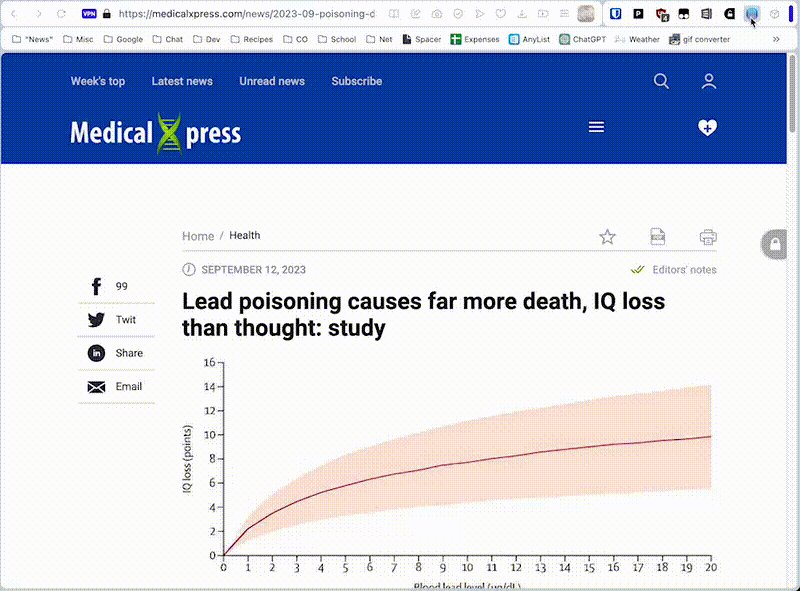

# Page Summarizer

Page Summarizer is a Chrome extension that utilizes OpenAI's GPT-3 API to
summarize text from a web page. Just highlight the text you want to summarize,
click the extension icon, and get a concise summary!

## Features

- Summarize the content of any web page
- Summarize the contents of selected text
- Customize instructions to get the information you want
- Add persistent custom instructions for all summaries
- Uses the OpenAI conversations API




## Installation

### Prerequisites

You'll need to have Google Chrome or a Chromium-based browser installed and an
API key from OpenAI. This _might_ work on Firefox, but I took exactly zero
minutes ensuring my API calls were cross platform. It does work on Opera,
though.

### Installation from latest release

1. Go to the [Releases](https://github.com/sysread/page-summarizer/releases) page of this repository.
2. Download the latest `chrome-extension.zip` or `firefox-extension.zip` based on your browser.
3. Unzip the downloaded ZIP file.
4. Open Google Chrome and navigate to `chrome://extensions/`.
5. Enable "Developer mode" in the top-right corner.
6. Click "Load unpacked" and select the directory where you unzipped the downloaded ZIP file.
7. The extension icon should now appear in your Chrome toolbar.
8. Right-click the extension icon and choose "Options", then enter your OpenAI API key and preferred model.

### Manual Installation from repo

1. Clone this repository to your local machine:

```bash
   git clone https://github.com/sysread/page-summarizer.git
```
2. Open Google Chrome and navigate to chrome://extensions/.
3. Enable "Developer mode" in the top-right corner.
4. Click "Load unpacked" and select the directory where you cloned the repository.
5. The extension icon should now appear in your Chrome toolbar.
6. Right-click the extension icon and choose "Options", then enter your OpenAI API key and preferred model.

## Usage

### Summarize the entire page

- Click the Page Summarizer extension icon
- Click "Summarize page"

### Summarize selected text

- Select the text you wish to summarize
- Right click and choose "Summarize selection" in the context menu

## Troubleshooting

- Make sure you've entered the correct OpenAI API key.
- Make sure your OpenAI account has sufficient API quota.
- Check the JavaScript console for any errors.
- Find the bugs in my code and submit a PR

## Contributing

Pull requests are welcome! For major changes, please open an issue first to
discuss what you would like to change.
